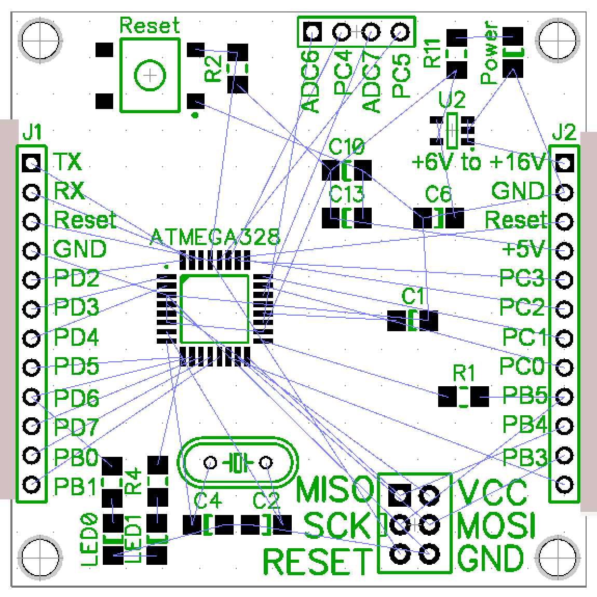

## Overview
Some files for an ATMEGA328 based microcontroller PCB. 

For deailed information about this microcontroller chip see the <a href="http://www.atmel.com/images/doc8161.pdf">ATMEGA328 datasheet</a>

Note: Still a work in progress, may have bugs...

## Schematic

## PCB Layout

A 5cmx5cm layout:

## Possible variations / modifications

* Use a larger board and put a ton of LEDs on
* Use through-hole components for easier soldering
* Use smaller components to practice soldering tiny SMD devices
* Use a different Atmel chip to get more I/O pins
* Add a USB port for serial communication, and use a newer Atmel chip that supports USB natively. These will have to run off 3.3V instead of 5V however, so use an appropriate voltage regulator. Some even provide Ethernet support.
* Add an FTDI or second ATMEGA chip which is connected to a USB port and can program the main chip.
* Hook up a LM61CIZ temperature sensors via an analog input
* Hook up an LCD screen and more buttons to make an interactive device

## Fabricating the boards

<a href="http://www.seeedstudio.com/service/index.php?r=pcb">Seeedstudio provides a cheap PCB fabrication service</a> out of China if you don't mind waiting on your boards to ship around the world.